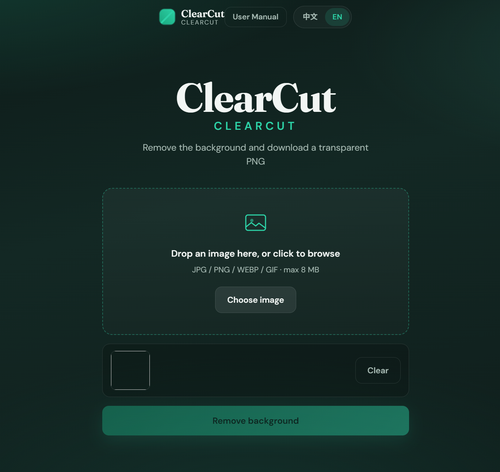
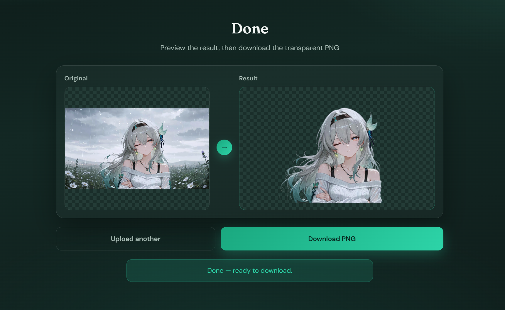

# ✂️ ClearCut — Remove Image Background

**ClearCut (净影)** is a bilingual (中文 / English) web tool that removes image backgrounds with browser-side AI and exports a transparent PNG. Built with PHP + HTML/CSS/JS for XAMPP and shared hosting (e.g. iFastNet) — **no MySQL required**.

---

## ✨ Features

### 🧠 Browser AI cutout
Runs subject detection in your browser (no server Python). First use may download the AI model; later runs are faster.

### 🖼️ Transparent PNG export
Preview original vs result (checkerboard = transparency), then download a ready-to-use PNG for design, commerce, or social posts.

### 🌐 ZH / EN interface
Switch language anytime. Settings stay in sync across Home and the in-app User Manual.

### 📘 Built-in User Manual
Step-by-step guide covering upload, processing, preview, tips, and FAQ — follows the selected language.

### 📤 Simple upload flow
Drag-and-drop or click to choose JPG / PNG / WEBP / GIF (max 8 MB), then one-click remove background.

---

## 🏗️ Tech Stack

| Category | Technology |
|---|---|
| 🖥️ Frontend | HTML5, CSS3, JavaScript |
| 🔙 Backend | PHP (pages + optional API helpers) |
| 🤖 AI cutout | Browser-side (`@imgly/background-removal` via CDN) |
| 🏠 Local Server | XAMPP (Apache) |
| ☁️ Hosting | Shared hosting friendly (e.g. iFastNet) |

---

## 📁 Project Structure

```
Remove_Background/
├── index.php
├── manual.php
├── config.php
├── api/
│   ├── process.php
│   └── download.php
├── assets/
│   ├── css/
│   │   ├── style.css
│   │   └── manual.css
│   ├── js/
│   │   ├── app.js
│   │   ├── i18n.js
│   │   └── manual.js
│   └── screenshots/
├── includes/
│   ├── footer.php
│   └── remove_bg.py
├── outputs/
├── uploads/
└── README.md
```

---

## ⬇️ Download & Run on Localhost

1. Download this project from GitHub:  
   **[Code → Download ZIP](https://github.com/dljk0927prog/Remove_Background)**  
   or clone:
   ```bash
   git clone https://github.com/dljk0927prog/Remove_Background.git
   ```
2. Extract the ZIP (if downloaded), then rename the folder to `Remove_Background`.
3. Put the folder into XAMPP:
   ```
   C:\xampp\htdocs\Remove_Background\
   ```
4. Open **XAMPP Control Panel** and start **Apache**.
5. Open your browser and go to:
   ```
   http://localhost/Remove_Background/
   ```

That’s it — you can start using the system right away.

> **Note:** Cutout runs in the browser. Allow CDN access on first run so the AI model can download. No database setup is needed.

---

## 🚀 How to Use the System

### 1) Remove a background
1. Open Home and pick **中文** or **EN**.
2. Drop an image into the dashed area (or click **Choose image**).
3. Click **Remove background** / **开始去背景** and wait for the progress bar.
4. Compare **Original** and **Result**, then click **Download PNG**.

### 2) Process another image
- Click **Upload another** / **再传一张** to return to the upload screen.

### 3) Read the manual
- Open **User Manual** / **用户手册** from the top bar or footer for steps, tips, and FAQ.

---

## 🖼️ Project Screenshots

| Home / Upload | Result preview |
|---|---|
|  |  |

---

## 🎬 Demo Video

Demo video coming soon.

---

## 📺 Demo / Links

| Resource | Link |
|---|---|
| 💻 Local (XAMPP) | `http://localhost/Remove_Background/` |
| 📦 GitHub Repository | [dljk0927prog/Remove_Background](https://github.com/dljk0927prog/Remove_Background) |

---

## ✅ Quick Test Plan

- [ ] Open `http://localhost/Remove_Background/` with Apache running
- [ ] Upload a JPG/PNG under 8 MB and complete cutout
- [ ] Confirm checkerboard transparency and PNG download
- [ ] Switch 中文 / EN on Home and Manual
- [ ] Open User Manual sections (steps, tips, FAQ)

---

## 📄 License / Copyright

Copyright © 2026 Desmond Liew. All Rights Reserved.

---

⭐ If this project helps you, please star the repository!  
✨ Feel free to explore, fork, and improve it.
